# Maricho Database Schema Design

This document outlines the normalized, relational database schema for Maricho, designed for PostgreSQL.

## 1. Entity-Relationship Diagram (Mermaid)

```mermaid
erDiagram
    PERSONS ||--o{ SKILLS : has
    PERSONS ||--o{ SERVICE_AREAS : covers
    PERSONS ||--o| STANDINGS : maintains
    PERSONS ||--o| WORKER_VETTING : "submits ID for"
    PERSONS ||--o{ WORKER_REFERENCES : submits
    PERSONS ||--o{ WORKER_VOUCHES : "is vouched for (worker_id)"
    PERSONS ||--o{ WORKER_VOUCHES : "vouches for others (voucher_id)"
    PERSONS ||--o{ CREWS : leads
    CREWS ||--|{ CREW_MEMBERS : includes
    PERSONS ||--o{ CREW_MEMBERS : "is member of"
    
    PERSONS ||--o{ JOBS : "requests (as buyer)"
    PERSONS ||--o{ JOBS : "assigned (as worker)"
    
    JOBS ||--o{ LEDGER_ENTRIES : generates
    JOBS ||--o| RECORD_ENTRIES : produces
    PERSONS ||--o{ RECORD_ENTRIES : owns

    SUBURBS ||--o{ SERVICE_AREAS : "covered by"
    SUBURBS ||--o{ JOBS : "located in"

    SUBURBS {
        varchar name PK
        decimal latitude "NOT NULL"
        decimal longitude "NOT NULL"
    }

    PERSONS {
        uuid id PK
        varchar phone UK "NOT NULL"
        enum role "BUYER, WORKER, OPS, AGGREGATOR"
        varchar next_of_kin_phone "not an FK: usually not a platform user, see §2.8"
        uuid guarantor_id FK "nullable, expected to be a registered person"
        timestamp created_at
    }

    SKILLS {
        uuid id PK
        uuid worker_id FK "NOT NULL"
        enum trade "PLUMBING, ELECTRICAL, SOLAR..."
        enum grade "REGISTERED, IDENTIFIED, APPRENTICE..."
        varchar proof_url
    }

    WORKER_VETTING {
        uuid worker_id PK, FK
        varchar id_photo_url "nullable, see §9"
        timestamp id_submitted_at "nullable"
    }

    WORKER_REFERENCES {
        uuid id PK
        uuid worker_id FK "NOT NULL, see §9"
        varchar name "NOT NULL"
        varchar phone "NOT NULL"
        timestamp created_at
    }

    WORKER_VOUCHES {
        uuid id PK
        uuid worker_id FK "NOT NULL, the worker vouched for, see §9"
        uuid voucher_id FK "NOT NULL, UNIQUE(worker_id, voucher_id)"
        timestamp created_at
    }

    SERVICE_AREAS {
        uuid id PK
        uuid worker_id FK "NOT NULL"
        varchar suburb FK "NOT NULL, references SUBURBS.name"
        enum travel_means "BICYCLE, BAKKIE, WALKING"
    }

    STANDINGS {
        uuid worker_id PK, FK
        enum grade "REGISTERED, IDENTIFIED, APPRENTICE..."
        decimal on_time_rate "Default 100.00"
        decimal dispute_rate "Default 0.00"
        decimal fill_rate "Default 0.00"
        int jobs_completed "Default 0"
    }

    CREWS {
        uuid id PK
        uuid lead_id FK "UK (One crew per lead)"
        varchar name
    }

    CREW_MEMBERS {
        uuid crew_id PK, FK
        uuid worker_id PK, FK
    }

    JOBS {
        uuid id PK
        uuid buyer_id FK "NOT NULL"
        uuid worker_id FK "Nullable until accepted"
        enum status "REQUESTED, MATCHED, BOOKED, IN_PROGRESS, DISPUTED, COMPLETED, CANCELLED"
        enum trade "PLUMBING, ELECTRICAL, SOLAR... (NOT NULL, drives matching)"
        varchar suburb FK "NOT NULL, references SUBURBS.name"
        text address "NOT NULL, hidden from workers until booking"
        text landmark_narrative "nullable, see §2.10"
        decimal latitude "nullable GPS pin, see §2.10"
        decimal longitude "nullable GPS pin, see §2.10"
        text problem_description
        varchar problem_photo_url
        enum currency "USD, ECOCASH, ZWG; set at booking, see §10"
        decimal labor_amount "Nullable until quoted, see §2.11"
        decimal materials_amount "Nullable until quoted, see §2.11"
        decimal quote_amount "Computed: labor_amount + materials_amount, see §2.11"
        timestamp created_at
        timestamp updated_at
    }

    LEDGER_ENTRIES {
        uuid id PK
        uuid job_id FK "NOT NULL"
        decimal amount "NOT NULL, > 0"
        enum entry_type "DEPOSIT_HELD, BALANCE_COMMITTED, RELEASED, REFUNDED"
        enum currency "NOT NULL, default USD, see §10"
        varchar external_reference "nullable, gateway transaction ref, see §10"
        timestamp created_at
    }

    RECORD_ENTRIES {
        uuid id PK
        uuid job_id FK "UK, NOT NULL"
        uuid worker_id FK "NOT NULL, denormalized from JOBS.worker_id, see §2.9"
        text what_was_done "NOT NULL"
        text client_words
        varchar before_photo_url
        varchar after_photo_url
        timestamp signed_off_at "NOT NULL"
    }

    JOBS ||--o{ DISPUTES : "raised against"
    PERSONS ||--o{ DISPUTES : raises

    DISPUTES {
        uuid id PK
        uuid job_id FK "NOT NULL"
        uuid raised_by_id FK "NOT NULL (buyer)"
        text reason "NOT NULL"
        enum status "OPEN, RESOLVED_RETURN_VISIT"
        text worker_response "nullable until answered"
        varchar before_photo_url
        varchar after_photo_url
        timestamp created_at
        timestamp responded_at "nullable"
    }

    PERSONS ||--o{ CREW_ORDERS : "requests (as buyer)"
    CREWS ||--o{ CREW_ORDERS : "booked to fill"
    CREW_ORDERS ||--o{ CREW_ORDER_LEDGER_ENTRIES : generates
    SUBURBS ||--o{ CREW_ORDERS : "located in"

    CREW_ORDERS {
        uuid id PK
        uuid buyer_id FK "NOT NULL (organization)"
        uuid crew_id FK "nullable until booked"
        enum status "REQUESTED, MATCHED, BOOKED, IN_PROGRESS, COMPLETED, CANCELLED"
        enum trade "NOT NULL, drives matching"
        varchar suburb FK "NOT NULL, references SUBURBS.name"
        text address "NOT NULL, hidden from crew until booking"
        text landmark_narrative "nullable, see §2.10"
        decimal latitude "nullable GPS pin, see §2.10"
        decimal longitude "nullable GPS pin, see §2.10"
        int workers_needed "NOT NULL, > 0"
        text problem_description
        enum currency "USD, ECOCASH, ZWG; set at booking, see §10"
        decimal labor_amount "Nullable until quoted, see §2.11"
        decimal materials_amount "Nullable until quoted, see §2.11"
        decimal quote_amount "Computed: labor_amount + materials_amount, see §2.11"
        text completion_note "nullable until completed"
        timestamp created_at
        timestamp updated_at
    }

    CREW_ORDER_LEDGER_ENTRIES {
        uuid id PK
        uuid crew_order_id FK "NOT NULL"
        decimal amount "NOT NULL, > 0"
        enum entry_type "DEPOSIT_HELD, BALANCE_COMMITTED, RELEASED, REFUNDED"
        enum currency "NOT NULL, default USD, see §10"
        varchar external_reference "nullable, gateway transaction ref, see §10"
        timestamp created_at
    }

    PAYMENT_GATEWAY_CONFIGS {
        varchar provider PK "e.g. ECOCASH"
        varchar merchant_code "nullable"
        varchar api_key "nullable, plaintext, see §10"
        varchar base_url "nullable"
        boolean is_sandbox "NOT NULL, default true"
        timestamp updated_at
    }

    ECOCASH_CALLBACK_LOGS {
        uuid id PK
        varchar external_reference "NOT NULL, indexed"
        text raw_payload "NOT NULL"
        timestamp received_at
    }
```

## 2. Normalization & Constraints

The schema is normalized to **3NF (Third Normal Form)** to ensure data integrity and eliminate redundancy. 

### Core Constraints

1.  **Unique Identifiers (UUIDv4):** All primary keys utilize UUIDs to prevent ID guessing and support offline-first sync (clients can generate UUIDs locally before syncing).
2.  **Phone Number Uniqueness:** `PERSONS.phone` is constrained as `UNIQUE`. A single phone number is the primary identity anchor in Maricho.
3.  **Composite Unique Constraints:**
    *   `SKILLS`: `UNIQUE(worker_id, trade)` — A worker cannot have duplicate entries for the same trade.
    *   `SERVICE_AREAS`: `UNIQUE(worker_id, suburb)` — A worker cannot duplicate suburb coverage.
4.  **One-to-One Relationships enforced via PK/UK:**
    *   `STANDINGS`: `worker_id` serves as both the Primary Key and a Foreign Key to `PERSONS.id`, enforcing a strict 1:1 relationship.
    *   `RECORD_ENTRIES`: `job_id` is marked `UNIQUE`. A job can only generate exactly one immutable record entry.
5.  **Check Constraints:**
    *   `LEDGER_ENTRIES.amount`: `CHECK (amount > 0)` — Ledger movements cannot be negative; reversals are handled by creating a new `REFUNDED` entry rather than altering past entries (immutability).
6.  **Referential Integrity (Foreign Keys):**
    *   Deletions of a `PERSONS` row cascade to `SERVICE_AREAS` and `SKILLS`, but **RESTRICT** deletion if they are tied to a `JOBS` or `LEDGER_ENTRIES` record to preserve immutable history.
7.  **Data Types (Enums):**
    *   Strict enumeration types are used for `status`, `role`, `trade`, `entry_type`, and `grade` to prevent arbitrary string insertion and maintain reporting cleanliness.
8.  **`guarantor_id` vs. `next_of_kin_phone` — a deliberate asymmetry, not an inconsistency:**
    *   `PERSONS.guarantor_id` is a proper self-referential FK because a guarantor is expected to be a registered person on the platform (someone with standing to vouch for another user).
    *   `PERSONS.next_of_kin_phone` is a bare phone string, not an FK, because a next of kin is expected to very often *not* be a platform user at all (a family member who never signs up) — a hard FK would force registering someone who has no reason to. If a next of kin later turns out to also be a registered `Person`, their phone string simply isn't linked to that row; this is an accepted trade-off, not a bug, since there is no current workflow that reads or writes this data.
    *   Both columns are currently unpopulated by any endpoint (dormant, tracked separately from this modeling decision) — this note exists so a future implementer doesn't have to reverse-engineer the reasoning before building whatever sets them.
9.  **`RECORD_ENTRIES.worker_id` — an intentional denormalization, enforced at the DB level:**
    *   `worker_id` is fully derivable via `job_id → JOBS.worker_id`, but is stored directly on `RECORD_ENTRIES` anyway so worker-scoped record queries (e.g. "show everything this worker has ever done") don't require a join through `JOBS`.
    *   Because this is a transitive dependency (a non-key attribute depending on another non-key attribute, not the table's own key), a `BEFORE INSERT` trigger (`check_record_entry_worker_matches_job()`, migration `a8bea2064338`) rejects any insert where `worker_id` doesn't match the referenced job's `worker_id`. Only `INSERT` is guarded — `record_entries` is already immutable (§7), so there is no `UPDATE` path to also protect.
10. **`JOBS`/`CREW_ORDERS` compound geo-grounding (ADR-004, implemented `b4bcfbff527d`):**
    *   `landmark_narrative`, `latitude`, and `longitude` are additive and nullable alongside the existing free-text `address` — a triangulated combination, not a replacement. None are required at request time.
    *   All three are gated behind the exact same access check as `address` (buyer, assigned worker, or OPS on `GET /jobs/{id}` / `GET /crew-orders/{id}`) — since they live on the same `JobOut`/`CrewOrderOut` response models, no separate masking logic was needed.
    *   `latitude`/`longitude` use the same `Numeric(9, 6)` precision as `SUBURBS`, validated at the API layer to standard GPS bounds (`-90..90`, `-180..180`); this is a per-job GPS pin, independent of and unrelated to the suburb-level centroid used for distance-band matching (§3).
11. **`JOBS`/`CREW_ORDERS` two-tier quote breakdown (ADR-003, implemented `56ca5ce0be51`):**
    *   `labor_amount` and `materials_amount` are set together by the quote endpoints (`POST /jobs/{id}/quote`, `POST /crew-orders/{id}/quote`); `quote_amount` is computed server-side as their sum and is never accepted directly from the client — the request payload has no `quote_amount` field at all.
    *   A `CHECK` constraint (`check_job_quote_equals_labor_plus_materials` / `check_crew_order_quote_equals_labor_plus_materials`) enforces that either all three columns are `NULL` (pre-quote) or all three are set with `quote_amount = labor_amount + materials_amount` — a partially-populated row (e.g. `quote_amount` set but `labor_amount` `NULL`) is rejected at the database level, not just by application logic.
    *   `materials_amount` may be `0` (a purely labor job); `labor_amount` must be `> 0` (there is always some labor cost to a job that reached the quote stage).

## 3. Suburb Distance Banding

`SUBURBS` is a small reference table (Bulawayo pilot: a handful of named
suburbs with approximate centroid coordinates, seeded via migration
`e17014832001_add_suburbs_reference_table_and_fk_.py`). `JOBS.suburb` and
`SERVICE_AREAS.suburb` are foreign keys into it — job requests and worker
service areas can only use a known suburb, which also lets the matching
engine compute proximity without an external geocoding service.

The matching engine (`app/matching.py`) computes the haversine distance
between a job's suburb and each candidate worker's declared service areas,
classifying it into a band:
*   `SAME_SUBURB` — identical suburb name (0km)
*   `NEARBY` — < 3km
*   `MODERATE` — < 8km
*   `FAR` — >= 8km (excluded from matching entirely)

Candidates are ranked primarily by distance band, and by standing (grade,
on-time rate, dispute rate, fill rate) as the tiebreaker within a band. The
seeded coordinates are approximate placeholders for the pilot and should be
refined with surveyed data before coverage widens beyond Stage One.

## 4. Job Lifecycle & Ledger State Machine

Implemented across `POST /jobs/{id}/book`, `/quote`, and `/complete`
(`app/routers/jobs.py`), backed by `app/ledger.py`:

| Job status transition | Actor | Ledger entry written | Amount |
| :--- | :--- | :--- | :--- |
| `MATCHED` → `BOOKED` | Buyer | `DEPOSIT_HELD` | Buyer-specified deposit |
| `BOOKED` → `IN_PROGRESS` | Assigned worker | `BALANCE_COMMITTED` | `quote_amount - deposit_held` |
| `IN_PROGRESS` → `COMPLETED` | Buyer (sign-off) | `RELEASED` | `quote_amount` (full payout) |

The worker submits `labor_amount` and `materials_amount` separately at the
quote step (ADR-003, §2.11); `quote_amount` above is always the
server-computed sum of the two, never a client-supplied number.

Booking also validates the chosen worker is a registered `WORKER` with a
matching `Skill` and not already tied to another active job (reusing the
same "busy" check the matching engine uses), and sets `Job.worker_id` —
which is what reveals `Job.address` to that worker (the existing
buyer/assigned-worker/OPS access check on `GET /jobs/{id}` already gates
this correctly, since `worker_id` is only ever set at booking).

A quote must exceed the deposit already held (the remaining balance
committed must be positive). Completion writes the immutable
`RecordEntry` (buyer-submitted `what_was_done`, `client_words`, before/after
photos) and the `RELEASED` ledger entry in the same transaction.

## 5. Dispute Resolution Workflow

Implemented across `POST /jobs/{id}/dispute` and `/dispute/respond`
(`app/routers/jobs.py`), per the PRD's "design for the worker's worst day"
rule:

| Job status transition | Actor | Effect |
| :--- | :--- | :--- |
| `IN_PROGRESS` → `DISPUTED` | Buyer | Opens a `Dispute` row (`OPEN`). No ledger entry is written — freezing means the existing `DEPOSIT_HELD`/`BALANCE_COMMITTED` entries simply aren't released while the status blocks `/complete`. |
| `DISPUTED` → `IN_PROGRESS` | Assigned worker | Records `worker_response` (+ optional before/after photo URLs) on the open `Dispute`, resolves it to `RESOLVED_RETURN_VISIT`, and sends the job back to `IN_PROGRESS` — the default outcome is a return visit, never an automatic refund. |

A disputed worker's standing is *frozen, not dropped*: `is_worker_disputed()`
(`app/matching.py`) checks for any job where that worker is currently
`DISPUTED`, and that same check is folded into the matching engine's
"busy" exclusion — a worker mid-dispute isn't offered new jobs either.
`GET /workers/me/standing` exposes this as a computed `is_frozen` boolean
rather than a stored, mutable flag, consistent with "standing is computed,
never assigned."

Because there's no execution-phase photo-upload endpoint yet (photos
otherwise only arrive at final sign-off via `/complete`), "the worker's job
photographs are attached automatically" is implemented as: the worker
submits before/after photo URLs alongside their dispute response, and they
are always included whenever the dispute is viewed — not sourced from
anywhere else. `REFUNDED` ledger entries and any OPS-driven refund/
arbitration path are not built — the only resolution path today is the
worker-initiated return visit.

## 6. Crew Hire (Stage Two, Built Ahead of Schedule)

The business case names Stage One (the current pilot) as using "hand-filled
crew orders," with a self-service "Crew Hire console for organizations"
named explicitly as **Stage Two** scope. This was built now at the user's
request, inventing the design from scratch since nothing else in the docs
specifies it.

### 6.1. Roster management (`app/routers/crews.py`)

An `AGGREGATOR` (crew lead, e.g. persona "Baba Moyo") creates one crew
(`CREWS.lead_id` is unique — one crew per lead) and directly adds/removes
`WORKER` members via `POST`/`DELETE /crews/me/members`. There is no invite/
accept sub-workflow: `CREW_MEMBERS` is a plain join table with no status
column, so membership is simply managed by the lead, unlike a job's
"pass costs nothing" worker autonomy.

### 6.2. Crew matching (`app/crew_matching.py`)

For a `CrewOrder`, every crew is scored by how many of its members: have a
`Skill` in the order's trade, a `ServiceArea` within `MODERATE` distance of
the order's suburb (reusing the same haversine bands as job matching — the
distance/band logic was extracted into `app/geo.py` so both engines share
it), and aren't individually busy (`is_worker_busy`, reused as-is). A crew
qualifies only if enough such members meet or exceed `workers_needed`; a
crew already committed to another active order (`is_crew_busy`) is excluded
entirely — **a crew is booked as a whole**, there is no sub-crew assignment
model, so it can't serve two orders at once even if oversized for both.

### 6.3. Booking, ledger and lifecycle (`app/routers/crew_orders.py`)

A parallel structure to the Quick Hire job lifecycle, deliberately kept
separate rather than overloading `LEDGER_ENTRIES`/`JOBS`:

| Order status transition | Actor | Ledger entry written | Amount |
| :--- | :--- | :--- | :--- |
| `MATCHED` → `BOOKED` | Buyer | `DEPOSIT_HELD` | Buyer-specified deposit |
| `BOOKED` → `IN_PROGRESS` | Crew lead | `BALANCE_COMMITTED` | `quote_amount - deposit_held` |
| `IN_PROGRESS` → `COMPLETED` | Buyer (sign-off) | `RELEASED` | `quote_amount` (full payout) |

As with Quick Hire, the crew lead submits `labor_amount`/`materials_amount`
separately (ADR-003, §2.11); `quote_amount` is the server-computed sum.

`CREW_ORDER_LEDGER_ENTRIES` reuses `prevent_mutation()` via its own
`crew_order_ledger_entries_immutable` trigger — insert-only, same as the
Quick Hire ledger. Unlike a job, completion does **not** produce a
`RecordEntry`: that table is shaped for one worker's individual
proof-of-work (`worker_id` singular, `UNIQUE(job_id)`), which doesn't map to
a multi-worker crew. Completion instead just sets a plain
`CrewOrder.completion_note` text field — there is no attendance/fill-rate
tracking per member, despite the business case naming that as the Crew Hire
value proposition; building that would mean designing a whole
attendance-record system with nothing in the docs to base it on.

**Explicitly not built:** dispute handling and `REFUNDED` entries for crew
orders (no `CrewOrderDispute` equivalent exists), and any accounting for
partial-crew assignment (sending only some of a crew's members to a job
while the rest stay available elsewhere).

## 7. Immutability 

To align with the design principle *"A record entry is immutable"*:
*   `RECORD_ENTRIES`, `LEDGER_ENTRIES`, and `CREW_ORDER_LEDGER_ENTRIES` tables will not have an `updated_at` column. 
*   Database-level triggers (`prevent_mutation()`, attached as `ledger_entries_immutable`, `record_entries_immutable`, and `crew_order_ledger_entries_immutable`) `RAISE EXCEPTION` on any `UPDATE` or `DELETE` statement targeting these tables — implemented in migrations `989350a9dd8d_immutable_ledger_and_record_entries.py` and `447e4d827227_add_crew_orders_and_crew_order_ledger_.py`. Corrections must be handled by appending new rows (e.g., a "Correction" table linked to the record, or specific ledger reversal types).

## 8. Case-Study Review Schema Adjustments: Status

A 2026-09-18 review of comparable service marketplaces, re-evaluated
specifically for Zimbabwe's operating conditions, produced five schema/
integration ADRs (002–005, plus 006 for the non-schema WhatsApp channel).
All five are now implemented: ADR-004's compound geo-grounding (§2.10),
ADR-003's quote breakdown (§2.11), ADR-005's progressive vetting tiers
(§9), and ADR-002's multi-currency ledger + EcoCash integration (§10).
Only ADR-006 (WhatsApp) remains outstanding — tracked as `BACK-009` in
`docs/backlog.md`, blocked on external Meta Business API setup, not a
schema change.

## 9. Progressive Vetting Tiers (ADR-005, implemented `c776d5d98df3`)

Closes the gap left open by the `grade`-enum finding ("nothing sets
`Skill.grade`/`Standing.grade` in practice") by defining and building the
promotion workflow. Three new tables, all `worker_id`-scoped — see the §1
ERD for their shape (`WORKER_VETTING`, `WORKER_REFERENCES`,
`WORKER_VOUCHES`).

`WORKER_VOUCHES` has a composite `UNIQUE(worker_id, voucher_id)` (one vouch
per voucher per worker) and a `CHECK (worker_id != voucher_id)` (no
self-vouching) — both enforced at the database level, verified directly
against Postgres, not just at the API layer.

### Promotion thresholds (`app/vetting.py::recompute_grade`)

Like `recompute_standing`, `Standing.grade` is fully re-derived from
evidence every time, never incremented — it can't drift:

| Grade | Requires |
| :--- | :--- |
| `IDENTIFIED` | A photographed national ID submitted (`WORKER_VETTING.id_photo_url` set) |
| `APPRENTICE` | `IDENTIFIED`, plus ≥ 1 `WORKER_REFERENCES` row |
| `JOURNEYMAN` | ≥ 1 vouch from a worker whose *current* `Standing.grade` is `JOURNEYMAN` or `EXPERT` |
| `EXPERT` | ≥ 3 such vouches |

A vouch's validity is re-checked against the voucher's *current* grade on
every recompute — there is no snapshot of the voucher's grade taken at
vouch time, so a vouch's weight tracks the voucher's own standing as it
changes.

**Known gap, documented rather than silently built around:** ADR-005 also
calls for excluding vouchers with "prior flagged fraudulent-vouch
strikes." No such strike/flagging mechanism exists yet — there's no
observed abuse pattern yet to design against. Only the grade-floor check
(`VOUCHER_MINIMUM_GRADE = JOURNEYMAN`) is enforced today.

### Endpoints (`app/routers/workers.py`)

- `GET /workers/me/vetting` — current evidence + computed grade.
- `POST /workers/me/vetting/id-photo` — submit/replace ID-photo evidence.
- `POST /workers/me/references`, `GET /workers/me/references` — add/list references.
- `POST /workers/me/vouches` — vouch for another worker; rejects self-vouches (422), non-worker/unknown targets (422), sub-`JOURNEYMAN` vouchers (403), and duplicate vouches (409, backed by the `UNIQUE` constraint).

All four mutate-then-recompute in the same transaction: evidence is
written, `recompute_grade` runs, then commit — the returned response
always reflects the post-recompute grade, never a stale one.

**Not addressed by this pass:** `Skill.grade` (the per-trade proof field)
remains unset — this workflow promotes the worker-level `Standing.grade`
only, since that's the field the matching engine (`app/matching.py`)
actually consumes. A per-trade grading refinement, if ever needed, is a
separate future scope.

## 10. Multi-Currency Ledger and EcoCash Integration (ADR-002, implemented `22a5feb5dcce`)

**Revision note:** the original draft of ADR-002 specified a worker-funded
commission wallet for cash-settled jobs. That was caught and reverted
*before* implementation for contradicting `business_case.md`'s explicit
"free for the worker" monetization model — see the dev-log entry
`Architecture_and_Design/MARITCHO-2026-09-18-adr-002-cash-settlement-design-contradicted-worker-never-charged-principle.md`.
What's actually built is described below.

### Schema

- `JOBS.currency` / `CREW_ORDERS.currency` (`CurrencyEnum`: `USD`,
  `ECOCASH`, `ZWG`) — set once, at booking, from the buyer's chosen
  payment method. Nullable until then. Every ledger entry written
  afterward (`BALANCE_COMMITTED` at quote, `RELEASED` at completion)
  reuses this same value — a job doesn't change settlement rail mid-life.
- `LEDGER_ENTRIES.currency` / `CREW_ORDER_LEDGER_ENTRIES.currency` — `NOT
  NULL`, defaulting to `USD` (the only currency that existed before this
  migration). Backfilled via a `server_default` on the migration's
  `ADD COLUMN`, then the server default is dropped — matching this
  project's "Python-side default only" convention elsewhere (e.g.
  `Standing.grade`). Verified against a non-empty table during
  implementation, not just an empty dev database.
- `LEDGER_ENTRIES.external_reference` / `CREW_ORDER_LEDGER_ENTRIES.external_reference`
  — the gateway's transaction reference, nullable (only ever set for
  `ECOCASH`-currency entries).
- `PAYMENT_GATEWAY_CONFIGS` (`provider` PK, `merchant_code`, `api_key`,
  `base_url`, `is_sandbox`, `updated_at`) — admin-editable EcoCash
  credentials, entered and rotated from the running system (OPS-only
  endpoints), not env vars. **`api_key` is stored as plain text** — a
  known, documented limitation, not an oversight; encryption at rest or a
  real secrets manager is out of scope for this pass and should land
  before real credentials are ever entered.
- `ECOCASH_CALLBACK_LOGS` (`id` PK, `external_reference` indexed,
  `raw_payload`, `received_at`) — an append-only (immutable, same
  `prevent_mutation()` trigger as `LEDGER_ENTRIES`) audit trail of every
  webhook call received. Deliberately *not* reconciled back into the
  immutable ledger tables by mutation.

### The buyer-funded model

Per the corrected ADR-002: the platform's fee is collected digitally from
the **buyer**, at booking, via a real EcoCash collection request — this
extends the existing `deposit_amount`/`DEPOSIT_HELD` mechanism (§4), it
does not replace it. The worker's portion of the agreed price is
collected directly from the buyer in physical cash, off-platform; Maricho
never holds or debits anything from the worker, at any point, for any
currency.

`POST /jobs/{id}/book` / `POST /crew-orders/{id}/book` now accept an
optional `currency` (default `USD`, meaning: behave exactly as before —
zero behavior change for existing callers). When `currency == ECOCASH`,
the booking endpoint calls `app/ecocash.py::initiate_collection()`
*synchronously*, as part of the request, before writing the
`DEPOSIT_HELD` ledger entry:

- Not configured (`PAYMENT_GATEWAY_CONFIGS` has no usable row) → `503`.
- Configured but the request fails, or the response is missing a
  transaction reference → `502`.
- Success → the returned reference is stored on the `DEPOSIT_HELD` entry
  (`external_reference`), and booking proceeds exactly as a `USD` booking
  would otherwise.

### Honesty note on the EcoCash client itself

No real EcoCash API documentation or sandbox credentials were available
when this was built (confirmed: no `.env`, no merchant keys, anywhere in
this project). `app/ecocash.py`'s request/response shape is a best-effort
guess at a typical mobile-money merchant collection API — real,
end-to-end-wired code (config → HTTP call → error handling → ledger
tagging), verified with `httpx.MockTransport` in tests, but **not**
verified against the live EcoCash service. `verify_webhook_auth()`
(a bearer-token check against the same configured `api_key`) is
explicitly documented in its own docstring as a placeholder, not a
confirmed signature-verification scheme — EcoCash's real webhook
authentication contract is unknown. Both should be re-checked against
real EcoCash documentation before any of this runs against production
traffic or real credentials.
