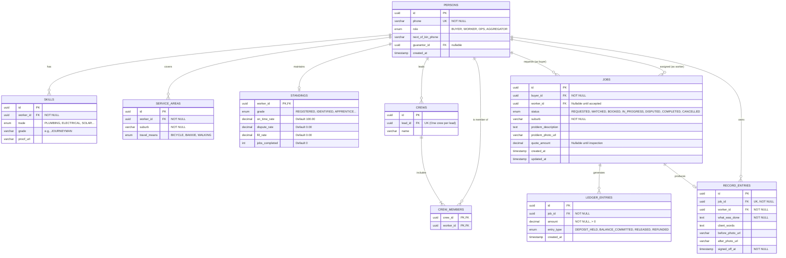

# Maricho Database Schema Design

This document outlines the normalized, relational database schema for Maricho, designed for PostgreSQL.

## 1. Entity-Relationship Diagram (Mermaid)

## 2. Normalization & Constraints

The schema is normalized to **3NF (Third Normal Form)** to ensure data integrity and eliminate redundancy. 

### Core Constraints

1.  **Unique Identifiers (UUIDv4):** All primary keys utilize UUIDs to prevent ID guessing and support offline-first sync (clients can generate UUIDs locally before syncing).
2.  **Phone Number Uniqueness:** `PERSONS.phone` is constrained as `UNIQUE`. A single phone number is the primary identity anchor in Maricho.
3.  **Composite Unique Constraints:**
    *   `SKILLS`: `UNIQUE(worker_id, trade)` — A worker cannot have duplicate entries for the same trade.
    *   `SERVICE_AREAS`: `UNIQUE(worker_id, suburb)` — A worker cannot duplicate suburb coverage.
4.  **One-to-One Relationships enforced via PK/UK:**
    *   `STANDINGS`: `worker_id` serves as both the Primary Key and a Foreign Key to `PERSONS.id`, enforcing a strict 1:1 relationship.
    *   `RECORD_ENTRIES`: `job_id` is marked `UNIQUE`. A job can only generate exactly one immutable record entry.
5.  **Check Constraints:**
    *   `LEDGER_ENTRIES.amount`: `CHECK (amount > 0)` — Ledger movements cannot be negative; reversals are handled by creating a new `REFUNDED` entry rather than altering past entries (immutability).
6.  **Referential Integrity (Foreign Keys):**
    *   Deletions of a `PERSONS` row cascade to `SERVICE_AREAS` and `SKILLS`, but **RESTRICT** deletion if they are tied to a `JOBS` or `LEDGER_ENTRIES` record to preserve immutable history.
7.  **Data Types (Enums):**
    *   Strict enumeration types are used for `status`, `role`, `trade`, and `entry_type` to prevent arbitrary string insertion and maintain reporting cleanliness.

## 3. Immutability 

To align with the design principle *"A record entry is immutable"*:
*   `RECORD_ENTRIES` and `LEDGER_ENTRIES` tables will not have an `updated_at` column. 
*   We will implement database-level triggers to `RAISE EXCEPTION` on `UPDATE` or `DELETE` statements targeting these tables after creation. Corrections must be handled by appending new rows (e.g., a "Correction" table linked to the record, or specific ledger reversal types).
