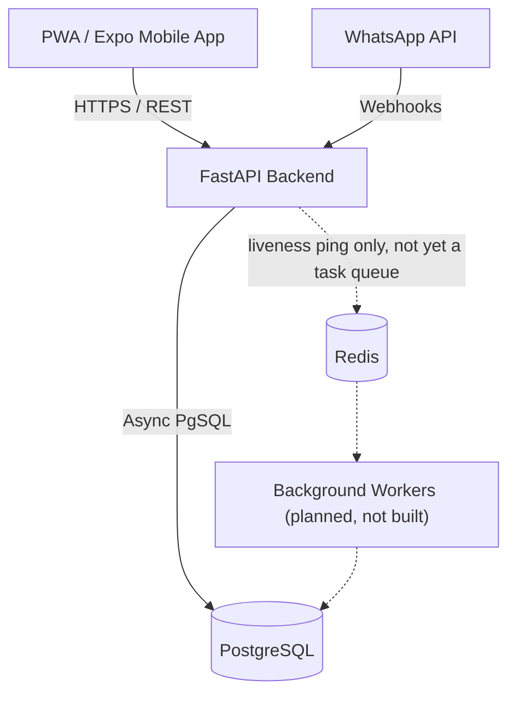

# System Design Document (SDD)

## 1. System Topology
Maricho utilizes a modular monolithic backend designed for self-hosted containerized deployment, communicating with Progressive Web App (PWA) and native mobile clients. 

The architecture consists of:
- **Client Tier:** React Native (Expo) mobile clients for offline-first capabilities. Next.js PWA for web access. WhatsApp Business API for SMS/Voice-note fallback.
- **API Gateway / App Server:** FastAPI (Python) serving a REST API and auto-generating OpenAPI schemas. Handles routing, auth, and request validation.
- **Message Broker (planned, not yet built):** Redis is provisioned in
  `docker-compose.yml` and reserved for background job queues (Celery/ARQ)
  per ADR-001, to eventually handle image processing and offline-sync
  ingestion. As of 2026-09-11, no queue library, task definitions, or
  worker process exist — Redis's only current use is a liveness ping from
  `/health/ready`. This is a deliberate deferral, not an oversight: no
  workload in the backend today (matching, standing recomputation, ledger
  writes) is expensive enough to need offloading, so the worker tier is
  being built when an actual async workload — e.g. photo upload/
  compression — requires it, per `docs/backlog.md`.
- **Database:** PostgreSQL for strong relational integrity, specifically surrounding ledger entries and immutable worker records.

## 2. Component Diagram

The dashed edges mark the part of this diagram that is aspirational: Redis
is running and reachable, but nothing publishes tasks to it and no worker
process consumes from it yet.

## 3. The Seven Core Objects (Entity Relationship)
1. **Person:** ID, phone, guarantor, next of kin, role (Buyer, Worker, Operations).
2. **Skill:** Trade, grade, how it was proven.
3. **Service Area:** Suburbs covered, travel means.
4. **Standing:** Computed metrics (grade, on-time rate, dispute rate, fill rate).
5. **Crew:** Lead ID + Member IDs.
6. **Job:** Request (voice/text/photo), spec, booking, quote, evidence, sign-off.
7. **Ledger & Record Entry:** Immutable transaction history. Deposit, balance, release. What was done, where, when, proof.

## 4. Observability & Telemetry
- **Tracing:** OpenTelemetry SDK configured in FastAPI to generate W3C Trace Contexts.
- **Metrics:** Prometheus endpoint exposing counters (e.g., jobs completed), gauges (e.g., active workers, DB connection pool size), and histograms (API latency). *Not yet implemented — tracked as a gap.*
- **Health Checks:** Native `/health/live` and `/health/ready` endpoints verifying DB and Redis availability.

## 5. Containerization

The API server itself (not just Postgres/Redis) is containerized, satisfying
the self-hosted containerized deployment requirement in full:

- **`backend/Dockerfile`:** multi-stage build on `python:3.11-slim`. The
  builder stage installs the project via `pip install .` (production
  dependencies only, no dev/test tooling); the runtime stage copies the
  installed packages and application source, then drops privileges to a
  dedicated non-root `app` user (uid/gid 1000) before `CMD` runs — satisfying
  the SRS's "containers must run as non-root" requirement. Final image is
  ~355MB.
- **`backend/docker-entrypoint.sh`:** runs `alembic upgrade head` before
  starting Uvicorn, so the container always brings the schema up to date on
  boot; this is idempotent (a no-op if already at head), verified by
  restarting the container against an already-migrated database.
- **`backend/docker-compose.yml`:** adds an `api` service alongside the
  existing `db`/`redis` services, wired with `depends_on: condition:
  service_healthy` on both (which required adding `healthcheck` blocks to
  `db` and `redis`, previously absent). The `api` service has its own
  `healthcheck` hitting `/health/live`.
- **CI (`.github/workflows/backend-ci.yml`):** builds the image and
  smoke-tests it (`docker run --network host`, poll `/health/ready` until
  200 or timeout) as the final gate, so a Dockerfile regression fails CI
  the same way a test failure would.

Background workers (Celery/ARQ, per §1's Message Broker) are not
implemented, so there is no separate worker container yet — only the `api`
service exists today.
