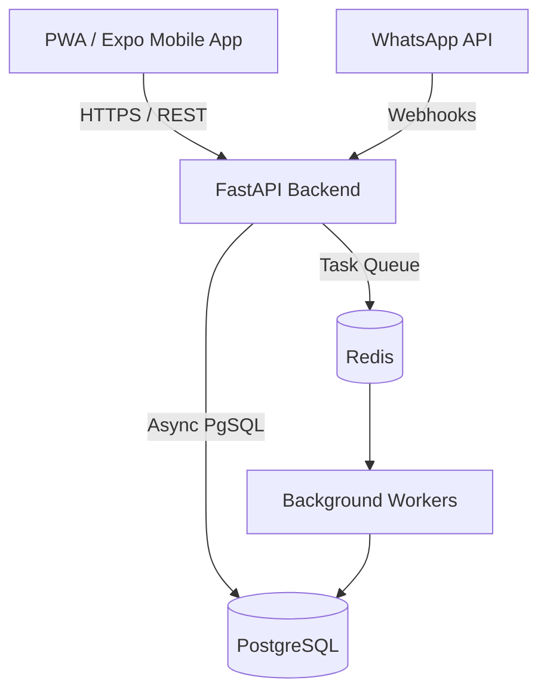

# System Design Document (SDD)

## 1. System Topology
Maricho utilizes a modular monolithic backend designed for self-hosted containerized deployment, communicating with Progressive Web App (PWA) and native mobile clients. 

The architecture consists of:
- **Client Tier:** React Native (Expo) mobile clients for offline-first capabilities. Next.js PWA for web access. WhatsApp Business API for SMS/Voice-note fallback.
- **API Gateway / App Server:** FastAPI (Python) serving a REST API and auto-generating OpenAPI schemas. Handles routing, auth, and request validation.
- **Message Broker:** Redis for background job queues (Celery/ARQ), handling image processing and offline-sync ingestion.
- **Database:** PostgreSQL for strong relational integrity, specifically surrounding ledger entries and immutable worker records.

## 2. Component Diagram

## 3. The Seven Core Objects (Entity Relationship)
1. **Person:** ID, phone, guarantor, next of kin, role (Buyer, Worker, Operations).
2. **Skill:** Trade, grade, how it was proven.
3. **Service Area:** Suburbs covered, travel means.
4. **Standing:** Computed metrics (grade, on-time rate, dispute rate, fill rate).
5. **Crew:** Lead ID + Member IDs.
6. **Job:** Request (voice/text/photo), spec, booking, quote, evidence, sign-off.
7. **Ledger & Record Entry:** Immutable transaction history. Deposit, balance, release. What was done, where, when, proof.

## 4. Observability & Telemetry
- **Tracing:** OpenTelemetry SDK configured in FastAPI to generate W3C Trace Contexts.
- **Metrics:** Prometheus endpoint exposing counters (e.g., jobs completed), gauges (e.g., active workers, DB connection pool size), and histograms (API latency).
- **Health Checks:** Native `/health/live` and `/health/ready` endpoints verifying DB and Redis availability.
