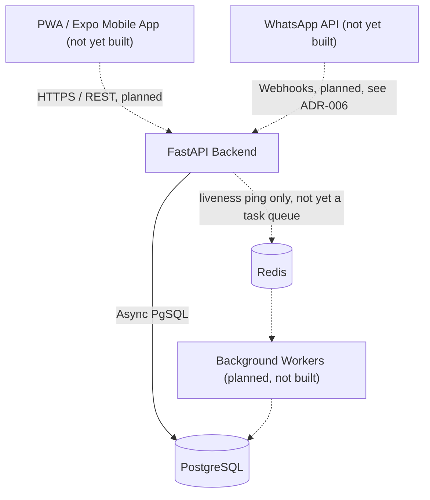

# System Design Document (SDD)

## 1. System Topology
Maricho utilizes a modular monolithic backend designed for self-hosted containerized deployment, communicating with Progressive Web App (PWA) and native mobile clients.

Internally, the backend follows Clean Architecture combined with domain-based "apps" (`app/apps/{accounts,suburbs,payments,workers,jobs,crews}/`, each with `domain/`/`infrastructure/`/`interface_adapters/` layers), plus `app/core/` (shared framework code) and `app/shared_kernel/` (framework-free vocabulary and cross-app ports) — see ADR-007 for the full rationale. This is an internal code-organization decision only: the HTTP contract, Postgres schema, and business behavior described below are unchanged by it.

The architecture consists of:
- **Client Tier:** React Native (Expo) mobile clients for offline-first capabilities (Sprint 3, `APP-00x`, not yet started). Next.js PWA for web access (not yet started). **WhatsApp Business API intake (planned, not yet built):** named as explicit Stage One scope in `docs/discovery/business_case.md`, but no WhatsApp integration code exists anywhere in `app/` today — see ADR-006. This line previously read as if the integration existed; corrected 2026-09-18.
- **API Gateway / App Server:** FastAPI (Python) serving a REST API and auto-generating OpenAPI schemas. Handles routing, auth, and request validation.
- **Message Broker (planned, not yet built):** Redis is provisioned in
  `docker-compose.yml` and reserved for background job queues (Celery/ARQ)
  per ADR-001, to eventually handle image processing and offline-sync
  ingestion. As of 2026-09-11, no queue library, task definitions, or
  worker process exist — Redis's only current use is a liveness ping from
  `/health/ready`. This is a deliberate deferral, not an oversight: no
  workload in the backend today (matching, standing recomputation, ledger
  writes) is expensive enough to need offloading, so the worker tier is
  being built when an actual async workload — e.g. photo upload/
  compression — requires it, per `docs/backlog.md`.
- **Database:** PostgreSQL for strong relational integrity, specifically surrounding ledger entries and immutable worker records.

## 2. Component Diagram

The dashed edges mark the parts of this diagram that are aspirational: the
FastAPI backend and its PostgreSQL connection are real and tested today; no
PWA, no mobile app, no WhatsApp integration, and no background worker exist
yet. Today the API is exercised directly (tests, curl/Postman, the
auto-generated OpenAPI docs) rather than through any of the dashed clients.

## 3. The Seven Core Objects (Entity Relationship)
1. **Person:** ID, phone, guarantor, next of kin, role (Buyer, Worker, Operations).
2. **Skill:** Trade, grade, how it was proven.
3. **Service Area:** Suburbs covered, travel means.
4. **Standing:** Computed metrics (grade, on-time rate, dispute rate, fill rate).
5. **Crew:** Lead ID + Member IDs.
6. **Job:** Request (voice/text/photo), spec, booking, quote, evidence, sign-off.
7. **Ledger & Record Entry:** Immutable transaction history. Deposit, balance, release. What was done, where, when, proof.

## 4. Observability & Telemetry
- **Tracing:** OpenTelemetry SDK configured in FastAPI to generate W3C Trace Contexts.
- **Metrics:** Prometheus endpoint exposing counters (e.g., jobs completed), gauges (e.g., active workers, DB connection pool size), and histograms (API latency). *Not yet implemented — tracked as a gap.*
- **Health Checks:** Native `/health/live` and `/health/ready` endpoints verifying DB and Redis availability.

## 5. Containerization

The API server itself (not just Postgres/Redis) is containerized, satisfying
the self-hosted containerized deployment requirement in full:

- **`backend/Dockerfile`:** multi-stage build on `python:3.11-slim`. The
  builder stage installs the project via `pip install .` (production
  dependencies only, no dev/test tooling); the runtime stage copies the
  installed packages and application source, then drops privileges to a
  dedicated non-root `app` user (uid/gid 1000) before `CMD` runs — satisfying
  the SRS's "containers must run as non-root" requirement. Final image is
  ~355MB.
- **`backend/docker-entrypoint.sh`:** runs `alembic upgrade head` before
  starting Uvicorn, so the container always brings the schema up to date on
  boot; this is idempotent (a no-op if already at head), verified by
  restarting the container against an already-migrated database.
- **`backend/docker-compose.yml`:** adds an `api` service alongside the
  existing `db`/`redis` services, wired with `depends_on: condition:
  service_healthy` on both (which required adding `healthcheck` blocks to
  `db` and `redis`, previously absent). The `api` service has its own
  `healthcheck` hitting `/health/live`.
- **CI (`.github/workflows/backend-ci.yml`):** builds the image and
  smoke-tests it (`docker run --network host`, poll `/health/ready` until
  200 or timeout) as the final gate, so a Dockerfile regression fails CI
  the same way a test failure would.

Background workers (Celery/ARQ, per §1's Message Broker) are not
implemented, so there is no separate worker container yet — only the `api`
service exists today.

## 6. Explicitly Rejected Patterns (Comparative Case-Study Review, 2026-09-18)

A review of comparable service marketplaces (Thumbtack, Taskrabbit, Urban
Company, Angi, Airtasker, Handy, Porch, Houzz, Checkatrade, MyBuilder,
Kandua, Lynk/Eden Life, ZiMLiNKS) informed four new ADRs (002–005) adjusting
Maricho's ledger, quoting, geo-capture, and vetting design for Zimbabwe's
operating conditions. The same review also surfaced patterns worth
recording as **deliberately rejected**, so they aren't silently
reconsidered later without the reasoning that ruled them out the first
time:

- **Upfront pay-per-lead charges (Thumbtack / Angi):** charging a worker
  before any match is confirmed disintermediates the platform and burdens
  undercapitalized workers. Maricho already avoids this — CORE-002/CORE-003
  only ever bill after a real booking, never for a bare lead.
- **Card/bank escrow as the *only* payment rail (Airtasker / Taskrabbit):**
  assumes a banking rail most of Maricho's target users don't have. See
  ADR-002.
- **Fixed-SKU catalog pricing with no worker-submitted quote (Urban
  Company):** doesn't survive Zimbabwe's volatile material and transport
  costs. See ADR-003.
- **Institution-dependent vetting (Checkatrade's 12-point check — credit
  bureaus, court records, formal trade-body accreditation):** depends on
  institutions and public verification APIs that don't exist or aren't
  queryable here. See ADR-005.
- **Capital-heavy owned training academies, branded tool fleets, and
  captive supply chains (Urban Company):** this is the same cost structure
  that contributed to Lynk's shutdown in a directly comparable African
  market — rejected as a structural risk, not evaluated further.
- **Large-scale streaming telemetry (Kafka/Spark/Avro, Urban Company):**
  the wrong scale for a Bulawayo pilot; already correctly deferred as
  `BACK-007`'s reasoning covers (a lightweight event bus, if one is ever
  needed, not a multi-node streaming cluster).
- **Third-party LLM app-store discovery channels (Angi's ChatGPT/Gemini
  apps):** a US high-intent-search discovery pattern with no local
  equivalent. The underlying idea (conversational AI intake) is still
  worth pursuing, but via WhatsApp (Kandua's "Ask Jess" pattern, see
  ADR-006), not a third-party LLM app store.
- **Visual-portfolio-first discovery (Houzz):** informal artisans won't
  have professional project photography ready; text/voice intake matters
  more here given data costs and literacy. Job-completion photos may
  opportunistically double as portfolio media later, but this is not a
  foundational discovery mechanism for Maricho.
- **Home-inspection-report data ingestion (Porch):** no equivalent formal
  home-inspection industry integrated with property transactions exists in
  this market to ingest from.
- **Dual-key OTP (arrival *and* completion) as a day-one requirement:**
  likely over-engineered for pilot scale. Completion-OTP alone captures
  most of the trust benefit at half the friction; arrival-OTP is worth
  adding later only if missed-appointment/no-show disputes actually become
  a measured problem.
- **Pure classified-directory model with no transaction mediation
  (Checkatrade / MyBuilder / ZiMLiNKS):** ZiMLiNKS is Maricho's own
  cautionary tale for exactly this failure mode in this market — no
  escrow, no quoting, no verification, complete disintermediation into
  unmonitored WhatsApp/phone calls. Maricho exists specifically to not be
  this.
