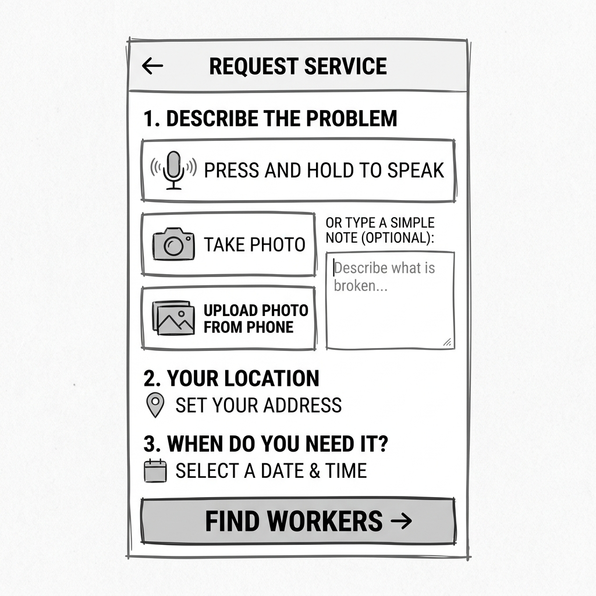
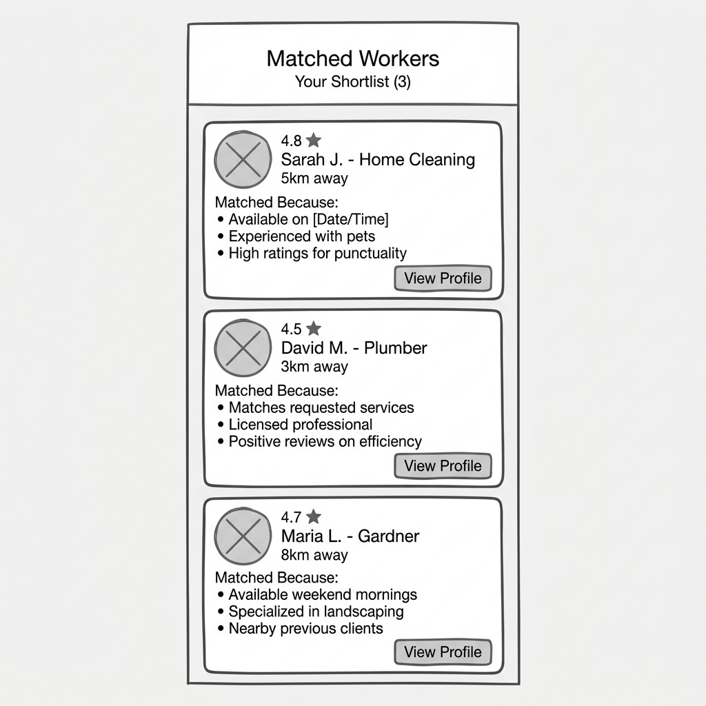
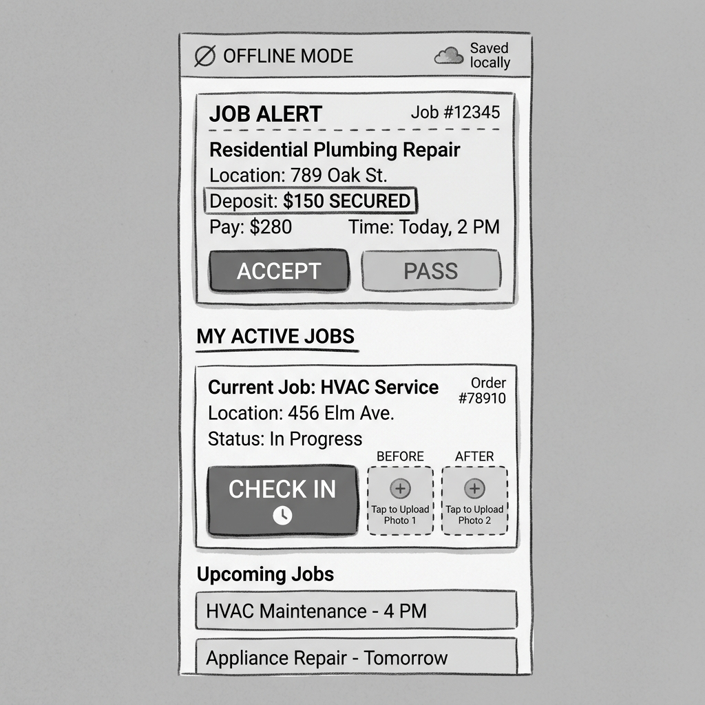

# Maricho Mobile App Wireframes

Based on the discovery and requirements documents, the mobile app design must prioritize accessibility for users with inexpensive Android devices, low digital literacy, and poor connectivity. The designs focus on a "text-first" approach with large, clear iconography and offline-first capabilities.

## 1. Buyer Home (Quick Hire)

**Goal**: Allow a homeowner to request a service as easily as sending a WhatsApp message.
**Key Features**:
- Voice input is prioritized over text.
- Photo upload with immediate on-device compression.
- Clear, distinct call-to-action to "Find Workers".

## 2. Worker Shortlist

**Goal**: Present exactly three candidates to the buyer with clear reasoning to build trust.
**Key Features**:
- Exactly 3 candidates shown (per PRD rules).
- Clear explanation of *why* they matched (e.g., specific skills, availability).
- Distance shown as a band (e.g., "5km away") rather than an exact address to protect worker privacy before booking.
- Simple "View Profile" action to see their standing and book.

## 3. Worker Dashboard

**Goal**: Provide the tradesman with a reliable tool to manage jobs, even offline.
**Key Features**:
- **Offline Status Indicator**: Prominent display when actions are queued locally (e.g., "Saved locally").
- **Job Alerts**: Clear notification of new jobs with the deposit status visible (Deposit Secured).
- **No-Penalty Pass**: Large, equal-weight "Accept" and "Pass" buttons.
- **Job Execution**: "Check In" button and placeholders for "Before" and "After" photos, crucial for dispute resolution.

## Design System Guidelines for Figma

When taking these wireframes to high-fidelity in Figma, keep the following constraints in mind:
- **Typography**: Use standard system fonts. Ensure high contrast for text (WCAG AAA for critical text).
- **Colors**: Default to a light mode with high-contrast grayscale. Use color sparingly for state (e.g., Green for "Secured", Red for "Offline").
- **Touch Targets**: Minimum 48x48dp for all interactive elements to accommodate varied physical work environments (gloves, dirty hands).
- **Assets**: Rely on system or lightweight SVG icons. Avoid heavy illustrations or background images to save data.
- **Language**: Ensure UI components can handle text expansion for translations (isiNdebele, chiShona).
